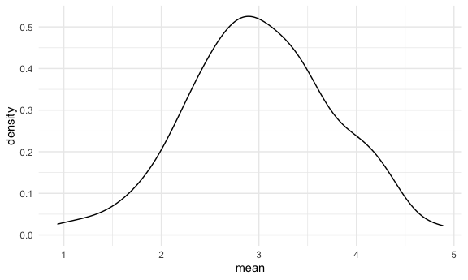
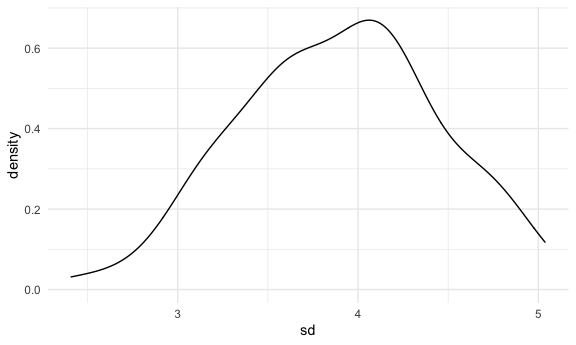

Simulations
================

## Let’s simulate something

I have a function.

``` r
sim_mean_sd = function(samp_size, mu = 3, sigma = 4) {
  
  sim_data = 
    tibble(
      x = rnorm(n = samp_size, mean = mu, sd = sigma)
    )
  
  sim_data %>% 
    summarize(
      mean = mean(x),
      sd = sd(x)
    ) 
  
}
```

I can “simulate” by running this line.

``` r
sim_mean_sd(30)
```

    ## # A tibble: 1 x 2
    ##    mean    sd
    ##   <dbl> <dbl>
    ## 1  3.45  4.77

## Let’s simulate a lot

Let’s start with a for loop.

``` r
output = vector("list", length = 100)

for (i in 1:100) {
  
  output[[i]] = sim_mean_sd(samp_size = 30)
  
}

bind_rows(output)
```

    ## # A tibble: 100 x 2
    ##     mean    sd
    ##    <dbl> <dbl>
    ##  1  2.35  3.19
    ##  2  4.16  2.97
    ##  3  3.85  4.37
    ##  4  3.14  3.56
    ##  5  3.87  3.80
    ##  6  2.34  3.89
    ##  7  2.78  3.98
    ##  8  2.55  4.53
    ##  9  1.73  4.53
    ## 10  3.16  3.25
    ## # … with 90 more rows

Let’s use a loop function.

``` r
sim_results = 
  rerun(100, sim_mean_sd(samp_size = 30)) %>% 
  bind_rows()
```

Let’s look at results ..

``` r
sim_results %>% 
  ggplot(aes(x = mean)) + geom_density()
```



``` r
sim_results %>% 
  summarize(
    avg_samp_mean = mean(mean),
    sd_samp_mean = sd(mean)
  )
```

    ## # A tibble: 1 x 2
    ##   avg_samp_mean sd_samp_mean
    ##           <dbl>        <dbl>
    ## 1          3.00        0.744

``` r
sim_results %>% 
  ggplot(aes(x = sd)) + geom_density()
```


